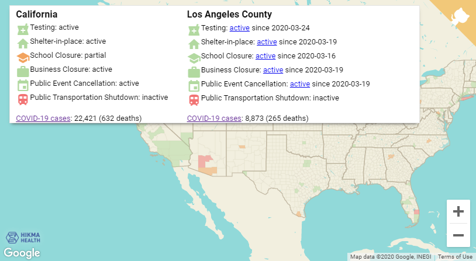

Overview
--------

This project contains a crowdsourced map of health policy data, broken down by county. A visual interface to the data is available [here](https://hikmahealth.github.io/covid19countymap). All of the structured data can be downloaded from the [`gh-pages` branch](https://github.com/hikmahealth/covid19countymap/tree/gh-pages), while all of the code to process the data is available as jupyter/colab notebooks on the master branch.

Data Sources
-------

State policy data was obtained from the following [report](https://www.kff.org/health-costs/issue-brief/state-data-and-policy-actions-to-address-coronavirus/#policyactions) by the Kaiser Family Foundation.

Cases counts displayed by county were obtained from the [New York Times dataset](https://www.nytimes.com/interactive/2020/us/coronavirus-us-cases.html).

County policy data was manually researched and entered into a web form in a crowdsourcing approach organized by [Hikma Health](https://www.hikmahealth.org/).

Demographic and geographic information about  states and counties were obtained from the [United States Census](https://www.census.gov/).

License and Warranty
-------

All code in this repository and the Hikma Health dataset of county-level policies are licensed under the Apache 2.0 license. For all other datasets, please see the underlying sources for license information. As a reminder, all code and data are provided here as-is with no warranty.
