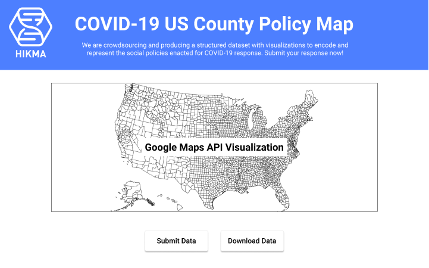
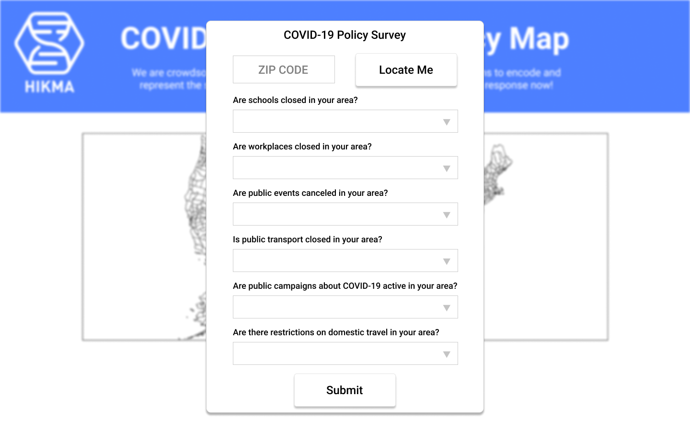

Our team from Hikma Health is crowdsourcing and producing a structured dataset with visualizations to encode and represent the social policies enacted for COVID-19 response. This project includes the following components:
 
1. A novel user interface to capture structured policies aggregated by US county. [Adesh Kadambi]
2. Export data on county-level policies into a single file suitable for data science use. [Dani Kiyasseh]
3. A secondary user interface for visualizing county-level data on a US map. [Senan Ebrahim]
 
A proof of concept of our map with county-level data displayed on hovering over the county of interest:
https://jsfiddle.net/9qye0Lb6/3/

The frontend system is still a work in progress and has been conceptualized with the wireframes below:

1. Landing page for the web application.

2. Survey form submission.

