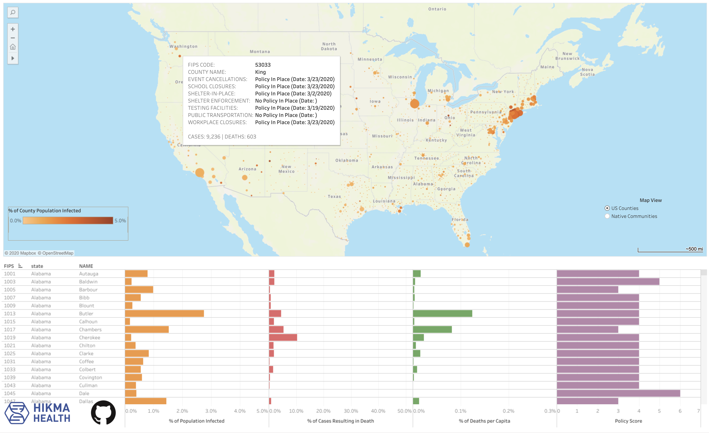

Overview
--------

This project contains a crowdsourced dataset of local policies enacted in response to COVID-19, broken down by local community in the United States. A visual map interface to the data is available [here](https://hikmahealth.org/map). All of the structured data can be downloaded from the [`gh-pages` branch](https://github.com/hikmahealth/covid19countymap/tree/gh-pages), while all of the code to process the data is available as [Python notebooks](https://github.com/hikmahealth/covid19countymap/tree/gh-pages).

Data Sources
-------
Data on COVID-19 policies enacted at the local level was manually researched, entered into a web form, and validated in a crowdsourcing approach organized by [Hikma Health](https://www.hikmahealth.org/). 

The US County Policies Dataset currently includes policy data from over 1,100 US counties, comprising over 250 million residents. Recommended citation for this dataset: Senan Ebrahim, Cray Noah, Henry Ashworth, Ali Ebrahim, Adesh Kadambi, Tara Pattilachan, Dani Kiyasseh, Melecia Wright, Eliza Nguyen, and Hassaan Ebrahim (2020). COVID-19 US County Policies, Hikma Health. Data use policy: Apache 2.0 License.

The Indigenous Communities Policy Dataset currently includes more detailed policy data from over 100 indigenous communities in the United States. Recommended citation for this dataset: Dana Vigue, Eliza Nguyen, Jessica Redmond, Arpi Tavil-Shatelyan, Anna Buford, John Laydon, Senan Ebrahim, Jaclyn Saitta, John Poppe, Tara Pattilachan, Darius Onul and Esrah Du (2020). COVID-19 Indigenous Communities Policies, Hikma Health. Data use policy: Apache 2.0 License.

State policy data was obtained from the following [report](https://www.kff.org/health-costs/issue-brief/state-data-and-policy-actions-to-address-coronavirus/#policyactions) by the Kaiser Family Foundation.

Case counts displayed by county were obtained from the [New York Times dataset](https://www.nytimes.com/interactive/2020/us/coronavirus-us-cases.html).

Demographic and geographic information about  states and counties were obtained from the [United States Census](https://www.census.gov/).

County R estimates are a subset of the estimates made by the models created by Youyang Gu [here](https://github.com/youyanggu/covid19_projections).

License and Warranty Disclaimer
-------

All code in this repository and the Hikma Health dataset of county-level policies are licensed under the [Apache 2.0 license](https://github.com/hikmahealth/covid19countymap/blob/master/LICENSE). For all other datasets, please see the underlying sources for license information. As a reminder, all code and data are provided here "as is" with no warranty, as described [here](https://github.com/hikmahealth/covid19countymap/blob/master/WARRANTY).

Acknowledgements
-------
We are grateful to the following volunteers for researching and submitting county policy data to construct this dataset: Henry Ashworth, Disha Bahl, Anna Buford, Michael Chen, Sara Dada, Katherine David, Amanda Delgado, Esrah Du, Ali Ebrahim, Hassaan Ebrahim, Senan Ebrahim, Daniel Estupiñan, Alison Farrar, Ryan Foley, Jonathan Franco, Ashley Fyle, Mary Gao, Jessica Genkil, Luke He, Josh Hyatt, Symone Isaac-Wilkins, Bryant Javier, Neena Joy, Adesh Kadambi, Ali Asghar Kassamali, Bina Kassamali, Princess Kaka, Kevin Kalin, Azka Khan, Saira Khan,, Armon Khosraviani, Dani Kiyasseh, Yekaterina Korol, Tobias Krussig, Shameer Kunnathapeedikayil, Tooba Laeeq, John Laydon, Lyssa Leininger, Sarah Liu, Faith Lyons, Noor Mahmood, Austin Manny, Tracy McNeil, Becky Mer, Ashley Miller, Sean Moore, Saketh Narahari, Leonard Nettey, Iola Nedavnyaya, Samantha Neumann, Eliza Nguyen, Thomas Nguyen, Sarah Nisivaco, Cray Noah, Felicia Noah, Wesley Noah, Daniel Ocampo, Camila Ochoa, Darius Onul, Phani Paladugu, Tom Parker, Neil Parsa, Tara Pattilachan, Olivia Plana, John Poppe, Melissa Prusky, Roshini Pudhucode, Nabeel Quryshi, Sarvani Ramcharran, Katherine Ranney, Arnab Ray, Vincent Ream, Jessica Redmond, Jaclyn Saitta, Emily Seltzer, Gregory Shedlock, Grei Shele, Emily Siegler, Max Silverman, Robert Simco, Sara Smith, Miguel Sobral, Kayla St Lucia, Stephen Suffian, Evan Stieler, Jeremy Swisher, Arpi Tavil-Shatelyan, Rajvir Thind, Nikhil Vallabhaneni, Corinna Vannozzi, Dana Vigue, Leia Wedlund, Joan Wells, Barthalomew Wilson, Emily Witt, Melecia Wright, Sonya Ye, Ashley Young, Gloria Young, Grace Young and Michael Zhou.
